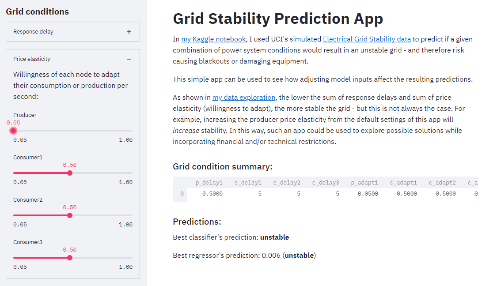
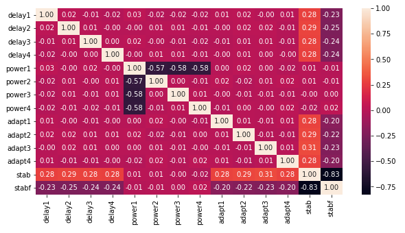
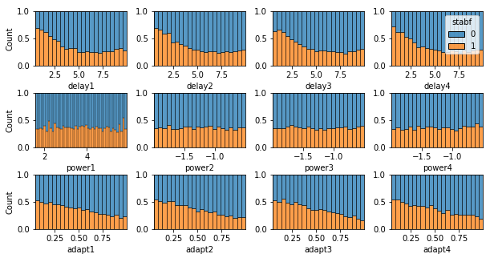
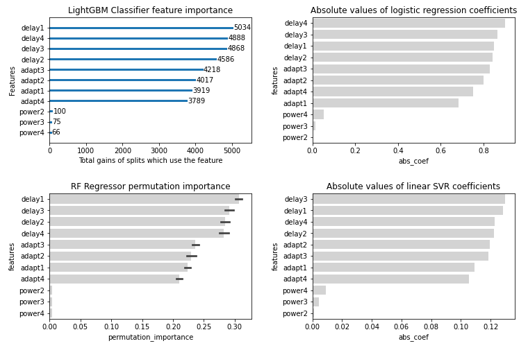
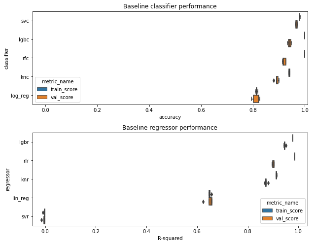
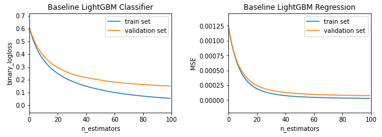
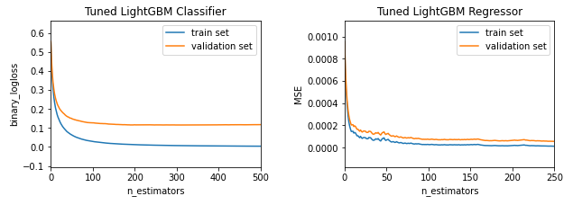
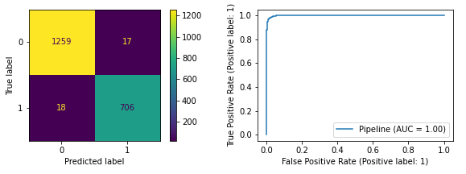

# Predicting smart grid stability

In [my Kaggle notebook](https://www.kaggle.com/sowlarn/predicting-smart-grid-stability/), I used UCI's simulated [Electrical Grid Stability data](https://archive.ics.uci.edu/ml/datasets/Electrical+Grid+Stability+Simulated+Data+) to predict if a given combination of power system conditions would result in an unstable grid - and therefore risk causing blackouts or damaging equipment.

I then created [a simple streamlit app](https://share.streamlit.io/sowla/grid_stability_app/main/grid_stability.py) that can be used to see how adjusting model inputs affect the resulting predictions:

This repo contains the source code.

 

The [notebook](https://www.kaggle.com/sowlarn/predicting-smart-grid-stability/) goes through data exploration and feature selection, followed by model fitting, tuning, testing and pickling. Here are some images for an idea:

 

 

 

